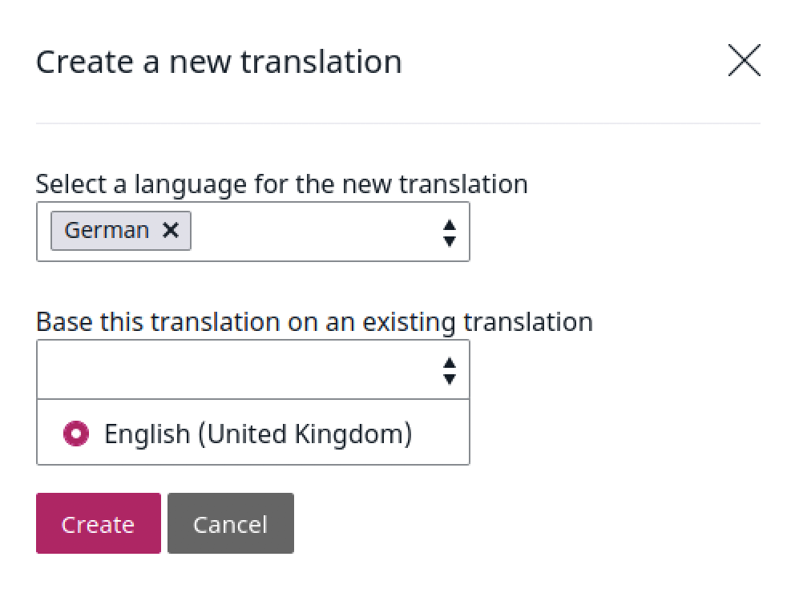

# Creating content, advanced

## Languages

The content on your website can be translated into different languages. Each Content item can have different language versions.
Which version is shown to a visitor depends on the way your installation is set up
(see [SiteAccess](https://doc.ezplatform.com/en/latest/guide/siteaccess/) for a technical explanation of the concept).

### Adding translations

You can create a new translation of a Content item by going to the **Translations** tab and activating the plus button.
You will see a list of all available languages. You can also base the new translation on an existing one.
All the fields will then be pre-filled with the values they have in the base translation.
If you do not choose a base translation, the fields will be empty. Every time you add or edit any translation,
the Content item gets a new version, the same way as when editing only one language.

You can only add translations in languages that have been set up for your website in the Admin Panel.
To create a new language for the website, go to the Admin Panel and the **Languages** tab and activate the plus button.

Every new language must have a name and a language code, written in the xxx-XX format, for example eng-US, fre-FR, nor-NO, etc.
After adding a language you may have to reload the application to be able to use it.

!!! caution

    After adding a language you should be able to start adding translations to your content.
    However, depending on the way your website it set up, additional configuration will probably be necessary
    for the new language to work properly, especially with siteaccesses.
    It's recommended you contact your administrator and inform them if you need to add a new language to the website
    (here is the [technical documentation of languages](https://doc.ezplatform.com/en/latest/guide/internationalization/)).

### SiteAccess

When working in Page mode you can see a bar at the top of the page listing SiteAccesses configured for your website.
SiteAccesses are a way of offering different versions of your website to different categories of users.
You can treat them as different "entrance points" to your website,
that allow you to show different content or design to the visitor, depending on which SiteAccess they use.
SiteAccesses can be used for example to serve a different website version for paying and non-paying visitors,
or different language versions to visitors from different countries.
You can use this bar to switch between and work on the different versions.

SiteAccess must be [set up by the administrator of the installation](https://doc.ezplatform.com/en/latest/guide/siteaccess/).
