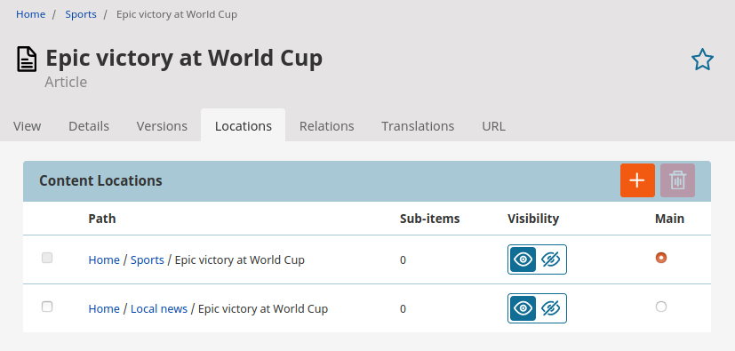
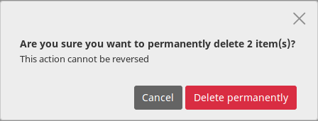
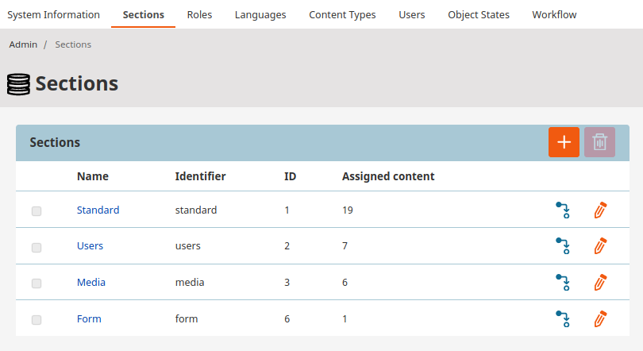

# Organizing the content

## Content Locations

A Content item by itself does not have a place in the Content tree and is not visible for a visitor of the website.
To be available on the website, it has to be assigned a Location ID.
A new Content item is automatically assigned a Location when you publish it.

A Content item can have more than one Location ID. In such a case you can find it in more than one place in the Content tree.
A single Location can only have one Content item in it.

!!! tip "Example"

    You can use multiple Locations for an Article about a local sports team's victory,
    which you can place in the tree both under Local News and Sports News.

Even if a Content item is placed in more than one Location, one of the Locations is always treated as the main one.

To assign other Locations to content, view this Content item's **Location** tab and activate **Add Location**,
then select the new parent from the Universal Discovery Widget.

### Hiding Locations

You can manage the availability of content by hiding or revealing it.
You can do this in the Content item's Locations tab by selecting **Hide** or **Reveal**.
Notice that hiding and revealing only affect a *Location*, not the *Content item*.
Even if you hide the content in one Location, it will still be visible in its other Locations.

When a Location is hidden, all of its children (other Content items that are under it in the tree) will also be automatically hidden.
They can only be revealed if the parent Location is revealed as well.

A hidden Location will be invisible for everyone viewing the website.
If you are looking for a way to allow only some users to view parts of the Content tree,
use [Sections](#sections) and combine them with [proper permissions](organizing_the_site.md#permissions).

### Swapping Locations

You can swap two Content items in their Locations by going to the **Location Content Swap** section
in the **Location** tab and selecting a Content item to swap with.

!!! caution

    Swapping Locations republishes their respective URL aliases.
    This means that if the swapped Content item was accessible by the URL that had a number at the end
    (added due to a name conflict), then after the swap the number will be removed (if possible).
    The opposite case also applies.

    Swapping Locations for Content item with the same name and parent results in swapping their URL aliases.
    This means that if the Content item was previously accessible by a URL without a number at the end,
    after the swap it will be accessible by a URL with a number at the end (and the other way around).

    If at some point there were more than two Content item with the same name under the same parent, then result of swapping such Content items might not be obvious. The general rule is that the Content item that previously had a higher number at the end of its URL alias will have its URL alias republished first, resulting in the lowest nonconflicting number (or the lack of) at the end of its URL alias. The Content item that previously had a lower number at the end of its URL alias will have its URL alias republished second, resulting in the second lowest nonconflicting number at the end of its URL alias.

## Managing existing content

### Moving and copying content

You can move or copy existing Content items by choosing the proper option from the menu on the right.
Copying creates a new Content item.
If you only want to have the same Content item to another place in the Content tree, add another Location to it.

You can remove content by activating **Send to Trash** in the menu.
In Page mode this option is located in the **Options** menu at the top.
If you remove a Content item that has children (other content under it in the content tree),
both this item and the children will be removed. This also breaks the connection between the items,
so you will not be able to restore them with the same structure.

Notice that the Content item is not removed completely.
It is moved to Trash, which you can access from the left menu.
In the Trash you can select removed Content items and restore them to their original Locations.

**Warning! You cannot restore Content items whose parent has also been removed.**

If a Content item has more than one Location, selecting **Send to Trash** will remove the Content item only from the current Location.
The content will appear in Trash only once you have removed the last Location.

You can permanently remove a Content item by checking it and clicking the trash icon.
You can also permanently remove all content from the Trash by clicking **Empty Trash**.

!!! caution "Warning"

    Emptying the Trash cannot be undone!

## Sections

You can divide your Content tree into Sections to better organize it.
Sections let you decide which users will have access to which parts of the tree.

You can set up Sections in the **Admin Panel**, in the **Sections** tab.
A few Sections are provided with each installation, and you can add new ones.

In the **Sections** tab, you can assign Sections to content or delete them.
You can only delete Sections that do not contain any content.

Each Content item must belong to a Section. By default, new content is placed in the same Section as its parent.
If you want to remove a Content item from a Section, you just need to assign it to a different one.

Access to Sections can be restricted by [setting up proper permissions](organizing_the_site.md#permissions).
