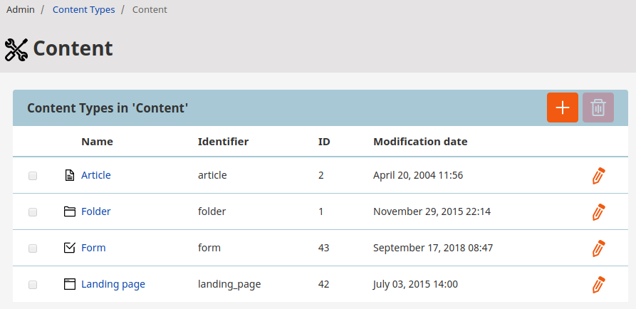
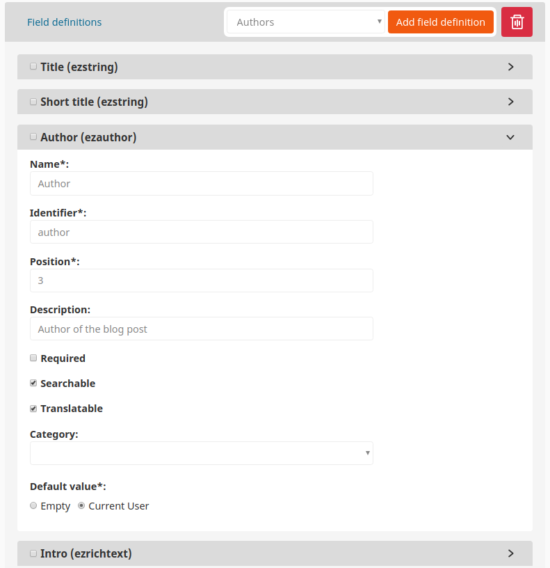
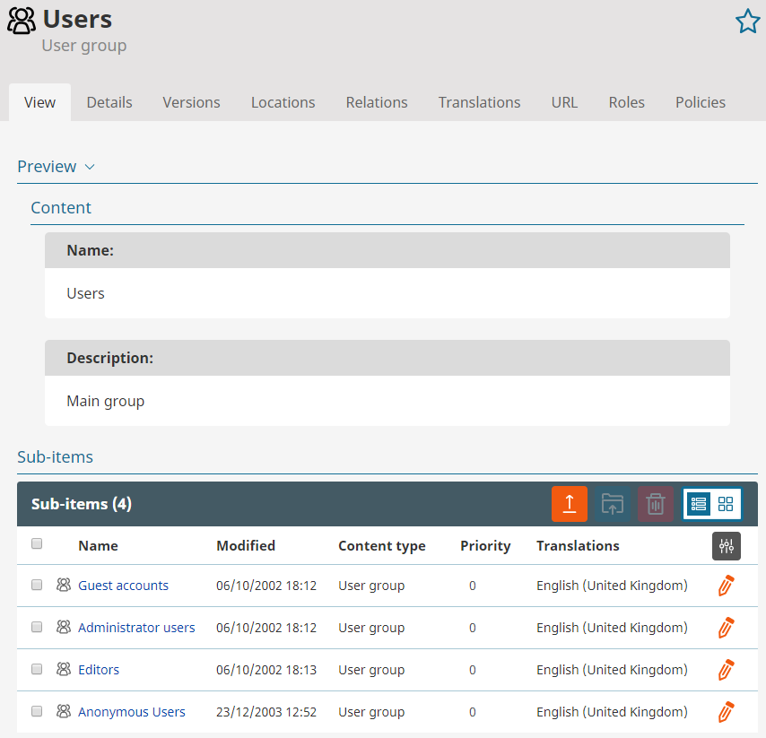
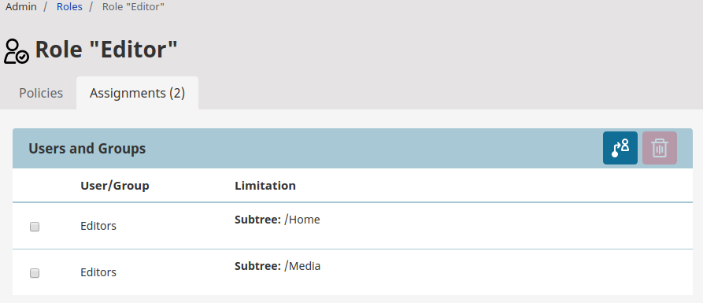

# Organizing the site

## Content Types

Content Types that constitute your content model are created in the Admin Panel.
Activate **Content types** in the panel and you will see groups into which the types are organized.
You can add your own groups here to keep your Content Types in better order.
Each group lists all the Content Types belonging to it, where you can modify the existing ones or add new ones.

Every Content Type has the following general settings:

- **Name**
- **Identifier** - name that identifies the Content Type in the system
- **Description** - additional information that will be displayed when creating new content based on this type
- **Content name pattern** - rules for creating the name for a Content item
- **URL alias name pattern** - rules for creating the URL alias for a Content item
- **Container** - when checked, Content of this Type can serve as a container in the Content tree
- **Default field for sorting children** - criterion by which children of this Content will be sorted in the tree
- **Default sort order** - order in which the children will be sorted (ascending or descending)
- **Default content availability** - when checked, Content of this Type will by default be always available,
even if it does not have a language version corresponding to the current SiteAccess.

To add a Field to the new Content Type, select a [Field Type](under_the_hood.md#fields-and-field-types)
in the Field Type selection drop-down menu and activate **Add field definition**.
You can determine the order in which Fields will be displayed by setting their Position parameter.

To delete Field(s), check the boxes next to any Field names and select the trash icon.

When a Content Type is modified, each instance of this type (each Content item based on this Content Type) will be changed as well.
If a new Field is added to a Content Type, this field will appear (empty) in every relevant Content item.
Therefore, if the new Field is required, it's recommended to provide a default value for it.
If a Field is deleted from the Content Type definition, all these Fields will be removed from Content items of this type.

Each field has a number of common parameters:

- Name - stores a user-friendly name that describes the Field.
The name of a Field can consist of letters, digits, spaces and special characters.
The maximum length is 255 characters. If a blank name is provided, the app automatically generates a unique name for the Field.
- Identifier - stores the Name in the system. The identifier can have no more than 50 characters
and can contain no special characters except underscore.
- Position - defines the order of the Fields in the Content Type
- Description - gives details about the Field that will be displayed next to it when editing content.
- Required - when this is checked, you will not be able to save or publish a Content item of this type unless the field in filled in.
- Searchable - decides if the contents of the Field will be covered by search.
- Translatable - decides if the Field can be translated.
- Category - decides which Field category it will be displayed in for easier organization.

Fields of specific types can also have their own additional settings.
For example, for the "Content relations (multiple)" Field Type you can decide
to have relations only to Content items of a specific, or any Content Type.

!!! caution

    The rules and templates for displaying content on your website are determined at developer level.
    That is why content of a new Content Type you create may not always display correctly or may cause errors.
    Therefore, it's always best to discuss the need for new Content Types with the administrator of your website
    to make sure whether they need to add it to the configuration.

## Users

Users in eZ Platform are treated the same way as other Content items.
They are organized in groups, which helps you manage them and their permissions.

You can view all User Groups and Users in the Admin panel by selecting **Users**.
As you can see, the interface here is the same as when working with regular Content items.

!!! caution

    Be careful not to delete an existing User account.
    If you do this, content created by this User will be broken and the application can face malfunction.

### Registering users

You can access the registration form for your website by adding `/register` to the address,
for example: `www.my-site.com/register`. By default, new Users created in this way are placed in the Guest accounts group.

## Permissions

Overview of the permission system in eZ is best presented using an example.

### Example of a permissions system

Let us assume you are managing a newspaper website. Your crew consists of an editor-in-chief
and several editors responsible for particular sections of the paper: general news, local news, sports etc.
You also have contributors who occasionally add new articles.
You want to give the editor-in-chief access to most parts of your website,
but the individual editors will only work with their own sections.
To the contributors you want to give the permissions to create new Content, but not to modify or delete existing Content.

In order to have this setup you need to create a number of different Roles: Editor-in-Chief, different Editor(s) and Contributor.

Even if you plan on having only one editor-in-chief, it is good practice to create a User group to contain this user,
and assign a Role to it instead of assigning permissions directly to the user.

To each of these Roles you need to assign proper Policies, giving them the right to perform certain actions.

The Editor-in-Chief Role would have the most Policies (although you may want to reserve some more advanced permissions only for system administrators).
Regular Editors need Policies allowing them to create, modify and delete Content.
Contributors can be given Policies permitting them to only create Content.

If you want to prohibit Editors from accessing Content in newspaper sections other than their own, you can add limitations to their Policies.
This means that instead of one Editor you need to have separate Roles for each editor profile:
Local Editor, Sports Editor etc. All of these Roles will have the same Policies,
but to each Policy you need to assign a limitation which would mean that the permission covers only one Section
(Sports section, Local News section etc.) that the editor works in.

Aside from Policies that define access to Content items, there are also many other Policy types concerned with administrating the system.
They cover actions such as activating new Users, creating Sections, modifying Content Types etc.

### Managing permissions

You can view and modify all permissions by activating **Roles** in the Admin panel.

Select the plus button and provide a name to get an empty, unassigned role.
You can now see the list of Policies the Role has - at the moment, none.
Activate the plus button again, select a Policy from the list and save it.
You then have an option to add Limitations to the Policy. The available Limitations depend on the chosen Policy.

After you are done choosing all Policies, you can assign the Role to users.
Go to the **Assignments** tab and activate the assign button.
Here you can choose users and/or groups that will be assigned this Role, with possible additional Limitations.
A User or User Group may be assigned multiple Roles.

