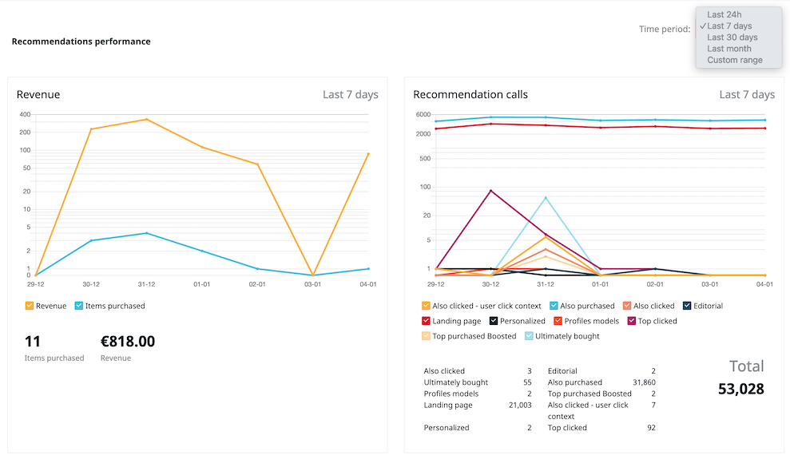

# Reviewing performance

You can review statistical information related to the functioning of the personalization service, 
to help you fine-tune [models](recommendation_models.md) and [scenarios](scenarios.md) and, 
in consequence, achieve better financial results.
You can do this by visiting the dashboard, where you can monitor the performance 
of the personalization service.

The dashboard consists of several sections:

- The top section contains tiles with the most important metrics, such as a number of recommendation calls, number of successful recommendations and so on.
- The diagrams section presents statistical information on how the personalization service is used and how successful recommendations are, depending on key performance indicators.
- The bottom section is made up of tables with detailed information, such as the most popular items.

## Statistical information

The diagram part consists of four main blocks:

- Revenue:
    The effectiveness of clicked recommendations in terms of revenue or the number of purchases.
- Recommendation calls:
    The number of recommendation calls (total and per scenario).
- Conversion rate:
    The absolute number of converted/sold recommendations.
- Collected events:
    Input data CLICK, BUY, and other events) that the personalization service collects 
    from the website. 
    For more information, see [Event types](event_types.md).

Revenue-through-recommendations is an additional monetary value that resulted from 
the clicked recommendations. 
It is calculated by summing up the revenue coming from products that users have purchased 
within 30 minutes from clicking a recommendation.

Purchased recommendations is the number of products sold, without any 
revenue/price information.

Conversion (or click-through) rate is an indicator of the acceptance and, subsequently, 
the quality of recommendations. 
It is calculated by dividing the total number of clicked recommendations by the number of 
recommendation calls. 
This statistic delivers reliable information if event tracking is implemented correctly.

You can select a timeframe for the diagrams from a list of presets, or define a custom date range.
If necessary, you can download the statistical information in XLS format.
