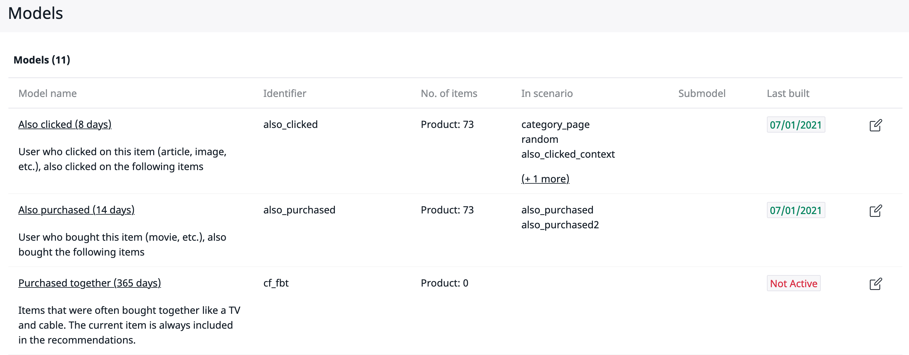
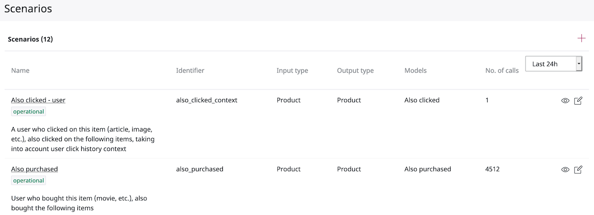

# Dashboard

The administration dashboard is the entry point to configure and control the Personalization Solution. 
It is split into several sections:

- The top section contains tiles with the most important metrics, such as a number of recommendation calls, number of successful recommendations and so on.
- The diagrams section presents statistical information on how the recommendation engine is used and how successful - depending on the KPIs - recommendations are.
- The bottom section is made up of tables with detailed information, such as the most popular items, or top purchases.

## Statistics

The diagram part consists of four main blocks:

- Collected events:
    The input data (clicks, buy, clickrecommended, ...) which is going into the recommendation engine for the customer website. For more information, see [Event Types](event_types.md).
- Recommendation calls:
    The number of recommendation calls (total and per scenario).
- Revenue:
    The effectiveness of recommendations regarding clicked recommendations, revenue through recommendations.
- Conversion rate:
     An absolute number of converted/sold recommendations.

The conversion (or click-through) rate is an **indicator of the acceptance** and therefore 
the **quality of recommendations**. 
It is calculated as follows: The total number of clicked recommended products divided by the amount of 
recommendation calls. 
This statistic only delivers reliable information if the tracking is implemented correctly.

The revenue-through-recommendations is a **monetary value** which was additionally created by recommendations. 
It is calculated as follows: If a user buys product A and has clicked on it as a recommendation within 
30 minutes before we assume it was sold through a recommendation.

Purchased recommendations is the **plain number of sold recommendations** without any revenue/price information.

All statistical information can be downloaded in MS Excel format. 
The timeframes depend on the selection of the diagram period (day, week, month, 3 months and year) but 
can also be customized.

## Configuration settings

The top bar provides you with access to the following pages, where you can configure the 
Personalization Solution.

### Models

The **Models** tab lists all available models and provides detailed information, such as the scenarios that use each model or when such model was last triggered.
You can also click the **Edit** icon to access the model configuration screen.

For more information, see [Recommendation Models](recommendation_models.md).

### Scenarios

The **Scenarios** tab contains a list of all available scenarios.
It also provides additional information, such as a description of each of the scenarios, models 
that the scenario uses, or indication of whether the scenario is operational or not.
You can also click the **Preview** icon to see an example of recommendations that the scenario 
returns or the **Edit** icon to access the scenario configuration screen.

For more information, see [Scenarios](scenarios.md).

### Import/Export

The **Import/Export** tab provides information about historical import operations and their details, such as 
a number of imported items.
Item import jobs fetch data from the recommendation client that tracks events to the recommendation engine.
The recommendation engine then processes the events and calculates the recommendations.

This mechanism is designed to import large portions of data, for example a weekly update of the whole product catalog.

For more information about different ways of feeding data to the recommendation system, see [Data import](content_import.md).
