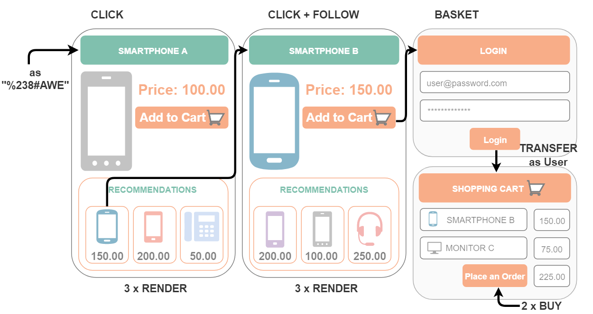

# Event Types

It was already mentioned that the recommendation engine collects events and computes recommendations 
based on user behavior. 
The most important events collected by the engine are click and buy events. 
They are enough for providing basic recommendations. 
There are some additional events for creating more complex scenarios and providing statistics about 
acceptance of recommendations, such as conversion rate or revenue. 

All possible events used in the system are described in the following table.

|Event|Description|
|---|---|
|CLICK|It should be sent to the recommendation engine if a user opens any detail page on the website.|
|BUY|It should be sent if something was bought.|
|CONSUME|Similar to the BUY event but without a payment. It is designed for publisher websites. This event is sent if an article or a web page is consumed (usually "read" or a "pre-listened" video).|
|RENDER|It should be sent if a recommendation is shown on the web page. This information is used by filters to suppress repeated recommendations of the same item.|
|FOLLOW / CLICKRECOMMENDED|If a user clicks on the recommended product the "clickrecommended" (sometimes called FOLLOW) event must be sent. It allows building acceptance statistics and enables A/B testing.|
|TRANSFER / LOGIN|A special type of event to deal with a user login after the user already surfed on the web page anonymously. It should always sent if the identifier of the user changed. As a result the anonymous history of the user will be transferred from the old identifier to the new one. This workflow is automatically done in the recommender engine.|

#### Additional events for the advanced edition

|Event|Description|
|---|---|
|BASKET|It should be sent when the user adds the specified product to the shopping cart. It allows creating recommendations for products the customer is interested in but which they finally did not buy for some reason.|
|BLACKLIST|Allows a user to suppress this recommendation. If the recommendation engine gets this event, the specified product or article won't be recommended anymore to the specified user. Default duration of suppression is one year.|
|OWNS|Same as BUY, but without influence on the statistics. It can be used if a user already owns the product, but bought it somewhere else, to avoid recommending it again.|
|RATE|Additional models can be created for the advanced edition, using this type of events. It allows building recommendations not only for implicit tracking events like "clicked" or "buy", but also for events with explicit value like "rated" or "liked". These events need additional integration into the web page to allow the user to give an appropriate feedback. The event should be triggered as a result of this user feedback.|

All the events require the current user ID and the ID of one or more context items. 
Some events need additional information. 
For more sophisticated algorithms and result filtering event types with additional parameters are needed. 
In the table below is a brief overview of additional parameter information.

|Event|Additional information|
|---|---|
|CLICK|Category path of the product a customer clicked on can be attached to the event. It is an alternative way to provide this information for a product without having a catalogue/export. This way is available for both basic and advanced editions. If an export is available to be fed into the recommendation engine, this information is ignored.|
|BUY|The price that a user paid for the product. This is an important parameter for the statistics and especially for A/B tests. Quantity of the products bought must be sent as well to be used in the revenue statistics.|
|FOLLOW/CLICKRECOMMENDED|The scenario which provided the recommendations must be sent in this event.|
|RATE|The rating (for example 1 to 5 stars) can be sent as an additional parameter.|
