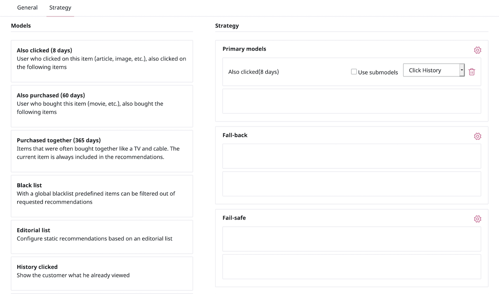
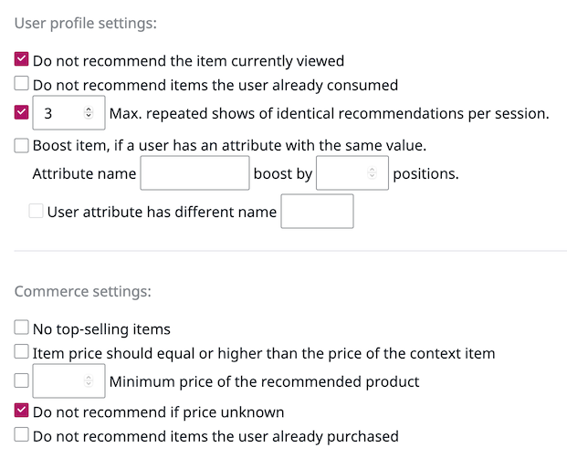

# Scenarios

A scenario is a configuration that is used to obtain recommendation results. 
It consists of:

- a content type to be returned as recommendation 
- a strategy (set of models) that is used for generating recommendations
- a filter configuration

If your [user role](../site_organization/organizing_the_site.md#permissions) includes 
the `Personalization/View` Policy, you can view the list of scenarios and preview their result.

To modify the scenarios to suit your needs, you must have the `Personalization/Edit` permissions.
You can then navigate to the **Scenarios** tab and click the **Edit** icon next to 
a name of the scenario.

## Content type configuration

Every scenario supports a single input type and multiple output types. 
Every recommendation request delivers only content of one output content type 
(even if multiple types are selected in the interface below). 
The output type is set during the recommendation request and must be covered by 
the list of the supported content types in the requested scenario.

## Strategy configuration

To modify the strategy, you drag model boxes between a list of all available models and the scenario 
matrix on the right side.
To avoid empty or insufficient recommendation results, add several models to a strategy.

You can arrange models within a strategy matrix by importance.
Models from each category are used in parallel and strategy results contain an equally 
distributed mixture of both model results. 
If models from a preceding category do not return enough results, models from the 
subsequent categories are used.

If your models support additional differentiators, you can apply them here:
pick a context from a drop-down with a list of available context options,
and/or select the **Use submodels** checkbox to group all products based on a selected attribute.
For more information, see [Advanced model configuration](recommendation_models.md#advanced-model-configuration). 

The configuration performed in this step is applied only to the selected scenario.

## Filter configuration

For every recommendation scenario a set of general filters can be defined that are applied to all recommendations from every model used in the scenario.

For more information, see [General filters](filters.md#general-filters).

For each of the categories from the strategy configuration matrix, you can click the **Configure** icon and configure category filters. 
For a detailed description, see [Category Filter](filters.md#category-filter).

## Previewing scenario results

You can preview the results of a scenario by clicking the **Preview** icon next to a scenario listed on the **Scenarios** tab.

Depending on the scenario type, you may need to provide additional information to see the results.
For example, for scenarios based on collaborative models, you must provide a value in the **User id** field, click **Add item** to select a context item from the Content Browser.
In some cases you might additionally have to click **Add category** and select a category to filter the results by. 

After you configure the query, click **Send request** to display the results.

Click **See response code** to preview the exact data object that is returned from the recommendation server and then used to generate the response.

For more information about collecting events and embedding recommendation results, see [Basic integration](integration.md).
