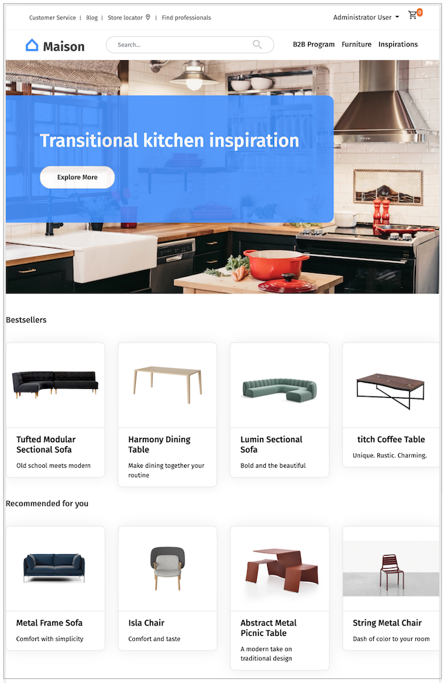
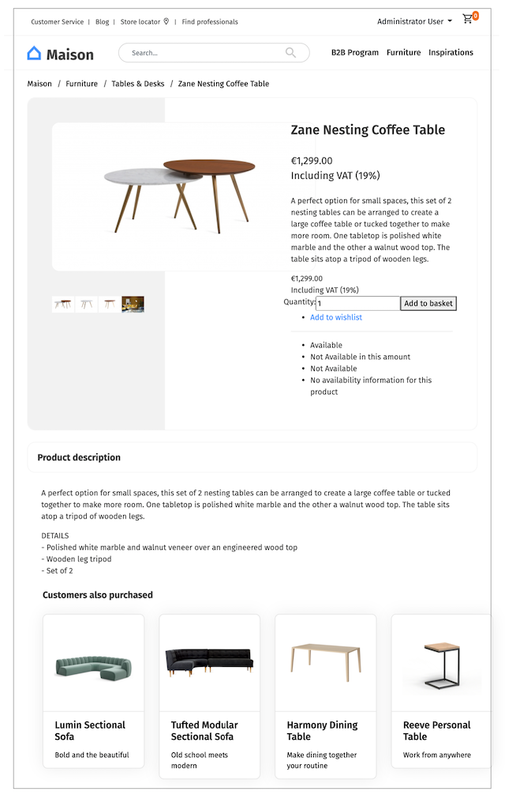

# Use cases

There are different areas where you can apply recommendations. 
The most common ones can be found in eCommerce and publishing.

## eCommerce

eCommerce recommendations can prove very useful in helping customers find what they are looking for. 
When a user is not sure about what to purchase, recommendations can suggest similar, alternative 
or complementary products. 
Some typical use cases are:

- Bestseller list shown on a home page
- 'What other customers bought' and 'Frequently bought together' lists on a product detail page 
- 'Related to your shopping cart' list on the shopping cart page
- Bestsellers in the current category shown on the category's landing page page
- A recommendation bar with recommendations based on the current user's profile

Each recommendation box in the above graphics represents a [scenario](scenarios.md). 
Scenarios are configurations that define what kind of recommendations should be delivered. 

### Content publishing

In publishing, recommendations bring indirect value by keeping users on the website. 
Unlike in eCommerce, publishers often provide content for free and are financed from advertisements. 
Increasing the click-through (or conversion) rate to increase profits from advertisements is one of 
the drivers here.
Use cases in publishing can be the following:

- A list of the most popular content shown on the home page
- Bestsellers in the current category shown on the category's landing page page
- Related content shown on the content detail page

