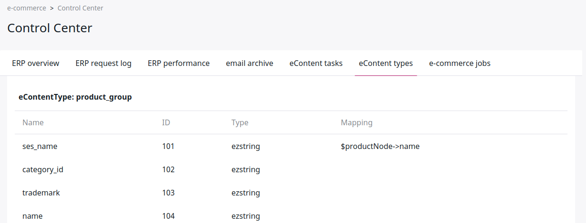
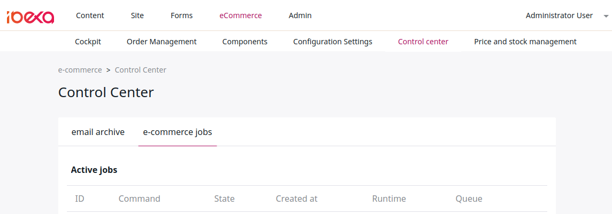

# Control center

Some sections of the Control center are available only when you have a connection to an ERP system.

## ERP request log

All communication (request and response messages) that is sent between shop and ERP system is recorded and displayed here.

## ERP performance

If an ERP system is connected, the ERP performance viewer shows the efficiency of the connection between the shop and the ERP system.
It displays the number of the different requests per date and time.

The monitoring tool regularly checks the connection to the ERP with a test request.

If the connection fails, the administrator receives an email.
If the connection is successful again, the alarm is ended by another email.

## email archive

In the **email archive** tab the shop owner/admin can find all emails which were automatically sent from the shop,
with date of sending, recipient, subject and status. They can see the emails and resend them.

## eContent tasks

If eContent is used as data provider, in the **eContent tasks** tab the administrator can see how many products and product groups there are in the shop.
They can create a new index, import a backup into the database and create a backup from the database.

## eContent types

In the **eContent types** tab the administrator can see the eContent types with their associated attributes and the mapping information.

## e-commerce jobs

The shop uses jobs to perform recurring tasks such as imports, backups etc.
The job system lists the last jobs and shows the status and result of the job.

